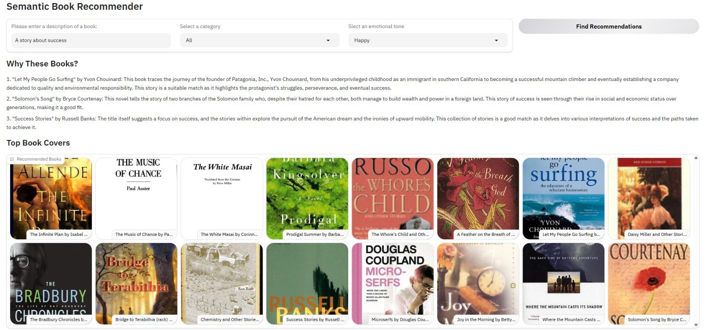

# 📚 LLM-Powered Personalized Book Recommendation Engine


### *Semantic + Emotion-Aware AI Recommender using RAG & LLM Reasoning*

> An intelligent recommendation system that understands **what users mean**, not just what they type — combining semantic retrieval, emotional personalization, and LLM reasoning to generate human-like book recommendations.

---



## 🚀 Project Highlights

✅ Built a **semantic recommendation pipeline** using embeddings + vector search  
✅ Integrated **LLM reasoning** to generate explainable recommendations  
✅ Designed an **emotion-aware ranking system** for personalized discovery  
✅ Implemented an end-to-end **Retrieval-Augmented Generation (RAG)** workflow  
✅ Delivered an interactive production-style UI using Gradio  

Unlike traditional recommenders based on ratings or keywords, this system performs **intent understanding + contextual reasoning**.

## 🧠 Problem Statement

Most recommendation engines fail when users describe preferences naturally:

> *“I want a motivating story about success that feels uplifting.”*

Keyword systems cannot interpret:

- semantic meaning  
- emotional intent  
- contextual similarity  

This project solves that gap using **LLMs + vector databases**.

## 🏗️ System Architecture

            User Natural Language Query
                         │
                         ▼
            OpenAI Embeddings (Semantic Encoding)
                         │
                         ▼
                Chroma Vector Database
               (Similarity Retrieval)
                         │
                         ▼
            Metadata + Emotion Filtering
            (Category + Sentiment Scores)
                         │
                         ▼
        LLM Reasoning Layer (GPT-4)
 → Generates human-like explanation
                         │
                         ▼
             Gradio Interactive Interface

## ⚙️ Core Technologies

| Layer               | Technology            |
|---------------------|-----------------------|
| LLM Reasoning       | OpenAI GPT-4          |
| Embeddings          | OpenAI Embeddings API |
| Vector Store        | ChromaDB              |
| Retrieval Framework | LangChain             |
| Frontend UI         | Gradio                |
| Data Processing     | Pandas, NumPy         |
| Environment         | Python + dotenv       |

## 🧩 Key Innovations

### 🔎 Semantic Retrieval (Beyond Keywords)

Book descriptions are embedded into vector space, enabling similarity search based on meaning rather than exact wording.

---

### 🎭 Emotion-Aware Personalization

Books are ranked using emotional signals:

- Joy → Happy reads  
- Fear → Suspenseful stories  
- Sadness → Emotional narratives  
- Surprise → Unexpected plots  
- Anger → Intense themes  

This introduces **affective computing** into recommendation systems.

---

### 🤖 LLM Explainability Layer

Instead of returning raw results, GPT-4:

- analyzes candidate books  
- reasons over descriptions  
- generates concise human explanations  

Result → recommendations feel curated by an expert.

## 📊 Pipeline Flow

1. User enters natural language description  
2. Query converted into embeddings  
3. Vector similarity search retrieves candidates  
4. Category + emotion filtering applied  
5. GPT generates reasoning summary  
6. UI displays explanations + book covers

## 📂 Repository Structure

.
├── app.py
├── books_with_emotions.csv
├── tagged_description.txt
├── assets/
│ └── demo.png
├── .env
└── README.md

## ⚡ Quick Start

### Clone Repository

```bash
git clone https://github.com/<your-username>/LLM-Powered-Personalized-Book-Recommendation-Engine.git
cd LLM-Powered-Personalized-Book-Recommendation-Engine
```

### Install Dependencies
```bash
pip install pandas numpy gradio langchain chromadb openai python-dotenv
```

### Add API Key
```bash
Create .env
OPENAI_API_KEY=your_key_here
```
### Run Application
```bash
python app.py
Open:
http://127.0.0.1:7860
```


## 🧪 Example Use Case
**User Input**
"A story about success and perseverance"
Tone: Happy

**System Output**

- Semantically matched books  
- Emotionally aligned ranking  
- AI-generated explanation  
- Visual recommendation gallery

## 📈 Engineering Takeaways

This project demonstrates production-relevant AI system design:

- Retrieval-Augmented Generation (RAG)
- Vector database indexing
- LLM orchestration pipelines
- Hybrid ranking strategies
- Explainable AI outputs
- Human-centered recommendation design

## 🔮 Future Enhancements

- Personalized user memory embeddings
- Hybrid collaborative filtering
- Streaming LLM responses
- Fine-tuned domain embeddings
- Cloud deployment (AWS / HuggingFace Spaces)
- Real-time recommendation feedback loop

---

## 🙏 Acknowledgements

This project was initially inspired by a YouTube tutorial demonstrating a semantic book recommendation system.

I extended the original implementation significantly by introducing additional AI system design components, including:

- ✅ Building a **Retrieval-Augmented Generation (RAG)** workflow
- ✅ Integrating an **LLM explanation layer** to generate human-like reasoning for recommendations

Original tutorial credit:
- FreeCodeCamp
- https://www.youtube.com/watch?v=Q7mS1VHm3Yw

## 👩‍💻 Author

**Neha Valeti**  
MS Data Science, Analytics & Engineering — Arizona State University  

AI/ML • LLM Systems • NLP • Retrieval Systems • Applied GenAI


## ⭐ Support

If you found this project interesting, consider giving it a ⭐ — it helps visibility and supports continued open-source work.


